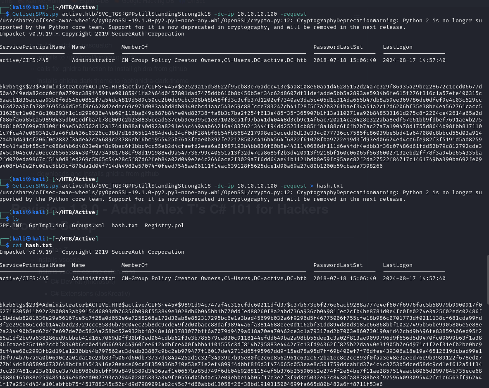

# Hack The Box: Box Summaries

## Active

In this box, I demonstrated penetration testing techniques by initially conducting network scanning to identify active devices and open ports, followed by exploiting vulnerabilities to gain unauthorized system access. Following this, I emploied Kerberoasting to extract and crack service tickets for revealing service account credentials. Finally, I utilized privilege escalation techniques to gain higher-level access within the compromised systems. This approach showcased my ability to identify and exploit vulnerabilities, assess security posture, and enhance overall security.

1. **Initial Reconnaissance**:
   - Performed network scanning using Nmap and enumeration with enum4linux to identify SMB shares with anonymous login access.

    
    
    

2. **SMB Exploitation**:
   - Explored SMB shares and downloaded files. Found a `Groups.xml` file containing a username and encrypted password.

    
    
    

3. **Password Decryption**:
   - Used GPP-Decrypt to decrypt the password. Accessed the SMB share with the `SVC_TGS` account and retrieved the User Flag.

    
    
    

4. **Kerberoasting Attack**:
   - Conducted a Kerberoasting attack using the SMB credentials to extract the Administrator password hash.

    
5. **Password Cracking**:
   - Employed Hashcat to crack the Administrator password hash, gaining access to the Administrator account.

    
    
    
6. **Privilege Escalation**:
   - Utilized `wmiexec.py` to obtain a shell as Administrator with the cracked password, ultimately retrieving the root flag.

    
    

## Sauna

In this box, I demonstrated penetration testing techniques by starting with network scanning and enumeration to uncover potential user credentials. I then leveraged these credentials to gain initial system access. Afterward, I employed tools like WinPEAS and Mimikatz for privilege escalation, extracting high-value credentials and ultimately gaining administrator-level access. This approach showcased my ability to effectively enumerate targets, exploit vulnerabilities, and escalate privileges to secure full control of the compromised system.

1. **Enumeration and Reconnaissance**:
   - Initiated the assessment by performing network scanning with Nmap and enumeration with enum4linux to gather information about the target system.
   - Analyzed the website content to identify potential employee usernames and compiled a list for further exploitation.

    
    

2. **Password Hash Extraction**:
   - Utilized the gathered usernames with `GetNPUsers.py` to attempt Kerberos pre-authentication and successfully generated a password hash.

   
   

3. **Password Cracking**:
   - Cracked the extracted password hash using John the Ripper, uncovering valid login credentials.

    

4. **Initial Access and Exploitation**:
   - Gained access to the system using `evil-winrm` with the cracked credentials, retrieving the user flag.
   - Began privilege escalation efforts to further penetrate the system.
    
    
    

5. **Privilege Escalation**:
   - Deployed a Python HTTP server to host WinPEAS, which was then downloaded and executed on the target system, leading to the discovery of additional login credentials.

    
    
    

6. **Credential Access and Post-Exploitation**:
   - Logged into the newly discovered account with `winrm` and downloaded Mimikatz from the Python webserver.
   - Executed Mimikatz to retrieve the Administrator's NTLM password hash.

   
   

7. **Final Privilege Escalation**:
   - Successfully passed the hash using `evil-winrm` to gain Administrator-level access, allowing retrieval of the root flag.

    
    
